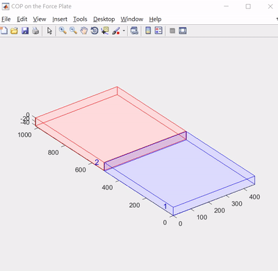

# Human Motion Analysis Programming
*Supervised by Prof. [Tung-Wu Lu](http://oemal.bme.ntu.edu.tw/professor/professorE.htm), Dept. of BioMedical Engineering, NTU*

MATLAB programs, which use the data derived from a motion capture system and force plates, for human motion analysis, including motion tracking, evaluation of body balance, and derivation of joint forces and torques of the lower body, etc.

## Requirements
1. MATLAB 2015 (or newer versions)
2. [MTIMESX function](https://www.mathworks.com/matlabcentral/fileexchange/25977-mtimesx-fast-matrix-multiply-with-multi-dimensional-support)(Fast Matrix Multiply with Multi-Dimensional)

## Functions & Execution Results
### Week1: Transformation between Global & Local Coordinate  
The transformation between global & local coordinate of marker position on lower body segemnts.  

### Week2: COP Tracking  
Derive the COP from data of two force plates and display the positions relative to force plates.  
  

  

### Week3: Euler Angle & Fixed Angle
1. Represent the rotations of body segemnts with **Euler angle** and **fixed angle**.  
2. Display the difference of Euler angle before and after **static calibration** of indivisual.  
  

### Week4: Curve Fitting
1. Smoothen the data curve and display the **angular velocity** of lower body.  
2. Consider right foot only, compare the results of **analytic solution of angular acceleration** & **1st derivation of angular velocity**.  
3. Consider right thigh only, compare the angular velocity derive from 12 sequence of Euler angle.  
The one with **Gimbal lock** during motion can be easily observed and then be avoided.  
  

### Week5: Quaternions (Euler Parameters)
1. Write the function "unwrapEP.m" to eliminate the discontinuity of Quaternions data.    
2. Compare angular velocity & angular acceleration derived from Euler angle and Quaternions(EP).  
  

### Week6: Screw Axis (Helical Axis)  
1. Compare the rotation axis and angle derived from Screw axis and Quaternoins.  
2. Determine the **joint center & rotation axis with least-square error** from several rotation axes dervied during the motion.  
  

### Week7: COM Tracking 
1. Derive & compare the COM position of whole body using Dempster's anthropometrical data with simplifying the body model as 7, 11, 12, & 13 segments.  
2. Display the COM positions. (Yellow: markers' position, green: COM of body segments, purple: COM of whole body).  
  

### Week8: Evaluation of Body Balance
Derive the COP data during the recipient is standing still. Determined the eclipse covering 95% of these COPs with **Principal COmponent Analysis (PCA)**. The area of the eclipse and length of its axes can be a indicator for evaluating one's body balancing ability.  

  

### Week9: Angular Momentum  
Derive the angular momentum and 1st derivation of angular momentum during the motion.
  

### Week10: Joint Moment & Joint Force
Derive the joint moment & joint force of angular momentum during the motion. The results are normalized by being divided by the weight of recipient.  

  

  

## misc
In the last few minutes of Marvel's The Punisher S1E1 (Netflix), a similar result appeared when a scientist recognized Frank Castle by gait detection.

  
